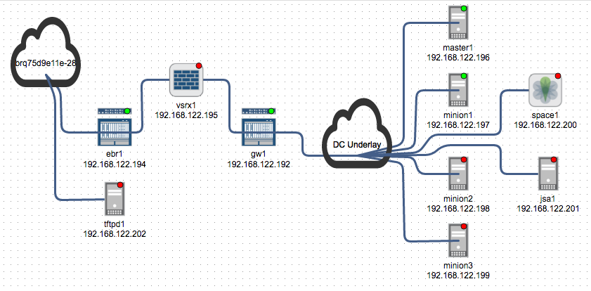

Wistar
======

Wistar is a tool to help create and share complex topologies of Virtual Machines and appliances.



Your (virtual) CPU must expose the virtualization hooks. You can check with a simple grep.

`egrep ‘(vmx|svm)’ /proc/cpuinfo`

If nothing is returned, you may need to modify BIOS to enable virtualization. Users running wistar within a virtual machine can search the Internet for enabling the VT hooks. As a note, wistar will not work in Virtualbox as the software does not support exposing the hooks to the guest. Some IaaS providers do not expose the flags (e.g., AWS) while others (i.e., DigitalOcean) do. 
  
Quick Start instructions for KVM deployments:
-----

To get started, you need a server running Ubuntu 14.04 (or some similar flavor) with libvirt, kvm and a few python tools.

Install the required Ubuntu packages-
```
root@wistar-build:~# apt-get install python-pip python-dev build-essential qemu-kvm libz-dev libvirt-bin socat python-pexpect python-libvirt libxml2-dev libxslt1-dev unzip bridge-utils genisoimage python-netaddr libffi-dev libssl-dev python-markupsafe libxml2-dev libxslt1-dev git
```

Install Python packages-
```
root@wistar-build:~# pip install pyvbox junos-eznc pyYAML Django==1.9.9 cryptography==1.2.1 websocket-client
```


Wistar uses Linux bridges to connect VMs to each other and to any external networks. To connect VMs to the external world, you'll need at least one NIC in a bridge. In this example, the first NIC is put in a bridge called 'br0'. To connect VMs to this NIC, add an 'External Bridge' object to the topology with the corresponding name 'br0'. Multiple external bridges are supported.

Here is an example /etc/network/interfaces. Modify as needed for your set-up.
```
auto lo
iface lo inet loopback

iface eth0 inet manual

auto br0
iface br0 inet static
	address 10.10.11.60
	netmask 255.255.240.0
	network 10.10.0.0
	broadcast 10.10.15.255
	gateway 10.10.10.1
	dns-nameservers 8.8.8.8
	bridge_ports eth0
	bridge_stp off
	bridge_fd 0
	bridge_maxwait 0
```

The easiest way to change the new configuration is to reboot as `sudo service networking restart` and `sudo /etc/init.d/networking` server are broken in Ubuntu 14.04 Server.

Create the images and instances directories.
```
root@wistar-build:~# mkdir -p /opt/wistar/user_images/instances
root@wistar-build:~# mkdir -p /opt/wistar/seeds
root@wistar-build:~# mkdir -p /opt/wistar/media
```

Clone the GitHub repo.

```      
root@wistar-build:/opt/wistar# git clone https://github.com/nembery/wistar.git
```

Creat the SQL tables.

```
root@wistar-build:/opt/wistar# cd wistar-master/
root@wistar-build:/opt/wistar/wistar-master# ./manage.py migrate
--snip--
root@wistar-build:/opt/wistar/wistar-master#
```

For development you can use the built-in web server.
```
root@wistar-build:/opt/wistar# cd wistar-master/
root@wistar-build:/opt/wistar/wistar-master# ./manage.py runserver 0.0.0.0:8080
```
Alternatively, you can configure a more robust web server such as Apache or nginx.

Here is how you can configure apache for use with wistar.
 ```
root@wistar-build:~# apt-get install libapache2-mod-wsgi
root@wistar-build:~# cat /etc/apache2/sites-enabled/999-wistar.conf
Define wistar_path /opt/wistar
Listen 8080
<VirtualHost *:8080>
	WSGIScriptAlias / ${wistar_path}/wistar/wsgi.py
	WSGIDaemonProcess wistar python-path=${wistar_path}
	WSGIProcessGroup wistar
	ErrorLog /var/log/apache2/wistar.log
	CustomLog /var/log/apache2/wistar_access.log combined
	Alias /static/ ${wistar_path}/common/static/

	<Directory "${wistar_path}/common/static">
		Require all granted
	</Directory>
	<Directory ${wistar_path}>
		<Files wsgi.py>
			Require all granted
		</Files>
	</Directory>
</VirtualHost>
```

Also, ensure the apache user is in the libvirtd group.
```
root@wistar-build:~# cat /etc/group | grep libvirt
libvirtd:x:111:nembery,nova,www-data
```
If not, use the following command to add the user to the group.
```
root@wistar-build:~# usermod -a -G libvirtd www-data
```


Quick Start for VMWare based deployments:
-----
A Packer based project to automatically build OVF images for VMWare
can be found here: https://github.com/nembery/wistar_packer


Uploading Images and deploying your first topology:
-----

To begin, browse to the 'Images' page and upload a qcow2 or vmdk based image.

Next, browse to Topologies to create and deploy a new network!

Send questions to nembery@juniper.net

Happy Hacking!

# Contributions
Wistar was written by Nathan Embery (nembery@juniper.net) with contributions from:
- Subrata Mazumdar
- Justin Adrian
- Jeff Loughridge
- Wayne Chan

# Getting help
Send questions to the Wistar Slack channel at:

https://wistar-vtm.slack.com/

More information may also be available here as well:

http://wistar.readthedocs.io/en/latest/


